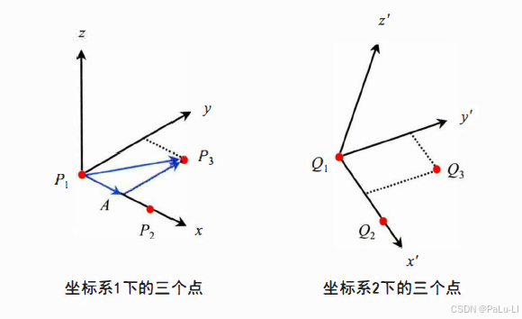

# Sim(3) 问题求解
## 目标
+ 已知至少 3 对匹配的不共线的三维点对，求它们之间的相对旋转($R$)、平移($t$)、尺度因子($s$)。

1. 求解坐标系单位向量

+ 假设点 $P_1,P_2,P_3$，$x$ 方向的单位向量为 $\hat{x}=\frac{P_2-P_1}{\|P_2-P_1\|}$，$y$ 方向的单位向量为 $\hat{y}=\frac{(P_3-P_1)-[(P_3-P_1)\hat{x}]\hat{x}}{\|y\|}$，$z$ 方向的单位向量为 $\hat{z}=\hat{x}\times\hat{y}$。

2. 由坐标系单位向量构成的基底矩阵分别记为 $M_1=[\hat{x}_1,\hat{y}_1,\hat{z}_1]$ 和 $M_2=[\hat{x}_2,\hat{y}_2,\hat{z}_2]$

+ 对任意向量 $v$，它在不同基底（$M_1,M_2$）的坐标系下分为 $v_1,v_2$，满足 $M_1v_1=M_2v_2$，即 $v_2=M_2^TM_1v_1$，则旋转 $R=M_2^TM_1$
  + 此方法只适用于 $P_1$ 在坐标原点且只有 3 个点的情况，因此需要一种采用一种更稳定、更精确的计算方式

## 最小二乘法求解sim(3)变换 
1. 构建残差方程
+ 假设有 $n$ 对匹配的三维点对 $(P_i,Q_i)$，根据变换关系有：$Q_i=sRP_i+t$
+ 定义误差 $e_i=Q_i-sRP_i-t$，目的为最小化残差，即最小二乘问题 $\min\limits_{s,R,t}\sum\limits_{i=1}^n\|Q_i-sRP_i-t\|^2$

2. 点集去中心化
+ 将点集去中心化，即 $P_i'=P_i-\bar{P},Q_i'=Q_i-\bar{Q}$，其中 $\bar{P},\bar{Q}$ 分别为点集 $P,Q$ 的均值向量
+ 去中心化后满足 $\sum\limits_{i=1}^n P_i'=0,\ \ \sum\limits_{i=1}^n Q_i'=0$
+ 此时误差方程变为 $\sum\limits_{i=1}^n\|Q_i-sRP_i-t\|^2=\sum\limits_{i=1}^n\|Q_i'+\bar{Q}-sR(P_i'+\bar{P})-t\|^2=\sum\limits_{i=1}^n\|(Q_i'-sRP_i')+(\bar{Q}-sR\bar{P}-t)\|^2$
+ 记 $t_0=\bar{Q}-sR\bar{P}-t$，则误差方程变为 $\sum\limits_{i=1}^n\|Q_i'-sRP_i'+t_0\|^2=\sum\limits_{i=1}^n\|Q_i'-sRP_i'\|^2+n\|t_0\|^2$

3. 计算 sim(3) 中的尺度因子 $s$
+ 旋转对模长无影响，有：$\|RP_i'\|=\|P_i'\|$
+ 对第一项进行展开并化简有：$\sum\limits_{i=1}^n\|Q_i'-sRP_i'\|^2=\sum\limits_{i=1}^n\|Q_i'\|^2-2s\sum\limits_{i=1}^n(Q_i'RP_i')+s^2\sum\limits_{i=1}^n\|P_i'\|^2$
+ 记 $S_Q=\sum\limits_{i=1}^n\|Q_i'\|^2$，$S_P=\sum\limits_{i=1}^n\|P_i'\|^2$，则化简为 $\sum\limits_{i=1}^n\|Q_i'-sRP_i'\|^2=S_Q-2s\sum\limits_{i=1}^n(Q_i'RP_i')+s^2S_p$
+ 根据二次函数极值点有 $s^*=\frac{\sum_{i=1}^n Q_i'RP_i'}{\sum_{i=1}^n\|P_i'\|^2}$
4. 将 $s$ 的解对称化
+ 上式若将 $Q$ 与 $P$ 互换，则为 $\frac{\sum_{i=1}^n P_i'RQ_i'}{\sum_{i=1}^n\|Q_i'\|^2}\neq \frac{1}{s^*}$，该解不具有对称性
+ 要利用下面的构造函数来使其对称：$\sum\limits_{i=1}^n\|e_i\|^2=\sum\limits_{i=1}^n\|\frac{1}{\sqrt{s}}Q_i'-\sqrt{s}RP_i'\|^2=\frac{1}{s}\sum\limits_{i=1}^n\|Q_i'\|^2-2\sum\limits_{i=1}^n(Q_i'RP_i')+s\sum\limits_{i=1}^n\|P_i'\|^2$
+ 极值点为 $s^*=\sqrt{\frac{\sum_{i=1}^n \|Q_i\|^2}{\sum_{i=1}^n\|P_i'\|^2}}$
5. 计算 sim(3) 中的旋转 $R$
+ 为使残差最小，需要将 $\sum\limits_{i=1}^n Q_i'RP_i'$ 的值最大化
+ 求解矩阵 $N=\begin{bmatrix}S_{xx}+S_{yy}+S_{zz}&&S_{yz}-S_{zy}&&S_{zx}-S_{xz}&&S_{xy}-S_{yx}\\S_{yz}-S_{zy}&&S_{xx}-S_{yy}-S_{zz}&&S_{xy}+S_{yx}&&S_{zx}+S_{xz}\\S_{zx}-S_{xz}&&S_{xy}+S_{yx}&&-S_{xx}+S_{yy}-S_{zz}&&S_{yz}+S_{zy}\\S_{xy}-S_{yx}&&S_{zx}-S_{xz}&&S_{yz}-S_{zy}&&-S_{xx}-S_{yy}+S_{zz}\end{bmatrix}$ 的最大特征值对应的特征向量，即为要求的四元数
  + 其中 $S_{a,b}=\sum\limits_{i=1}^nP_{i,a}'Q_{i,b}'$

6. 计算 sim(3) 中的平移 $t$
+ 令 $t_0=0$，即 $\bar{Q}-sR\bar{P}-t=0$，则 $t^*=\bar{Q}-sR\bar{P}$